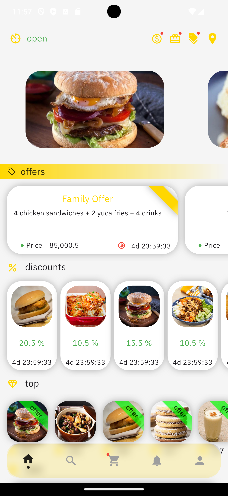
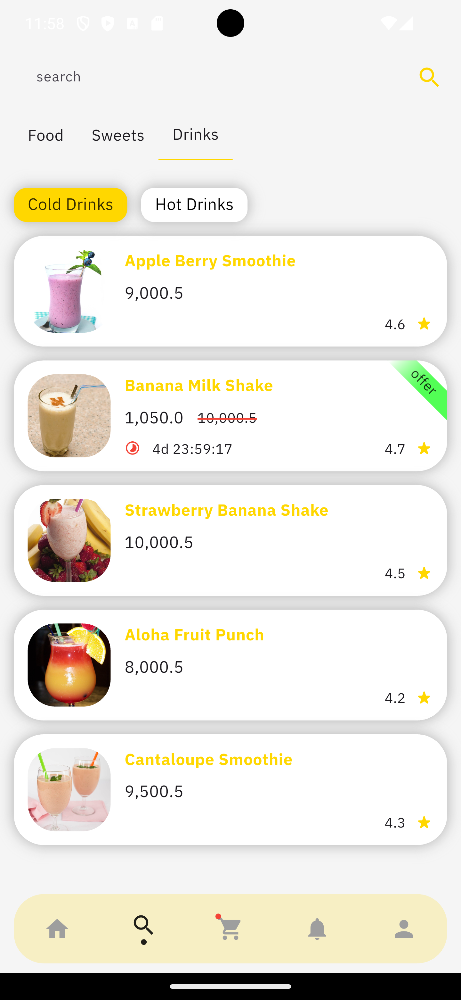
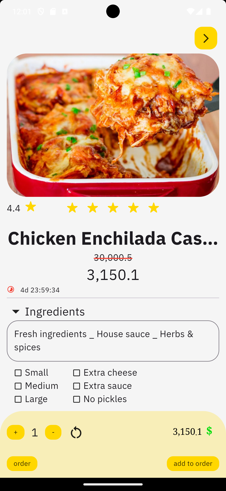
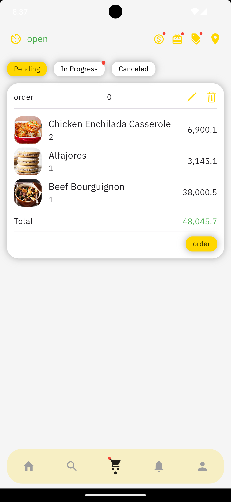
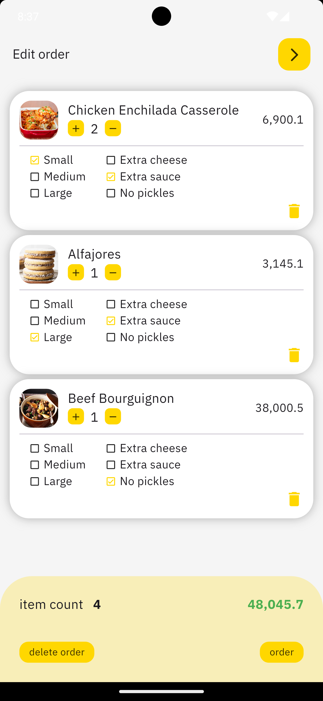
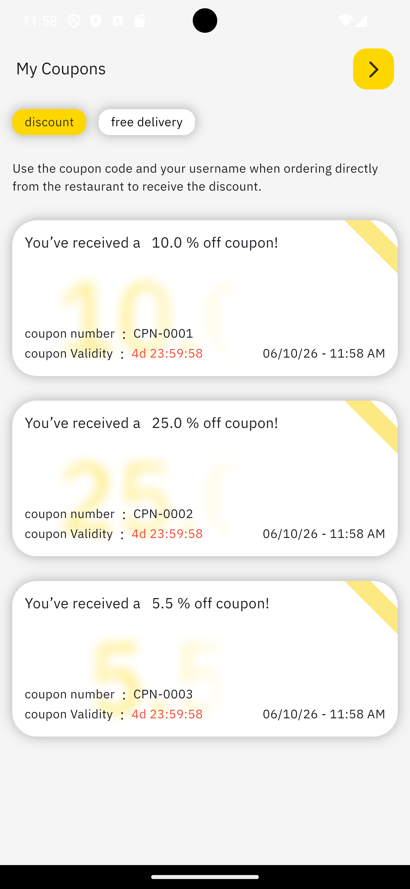
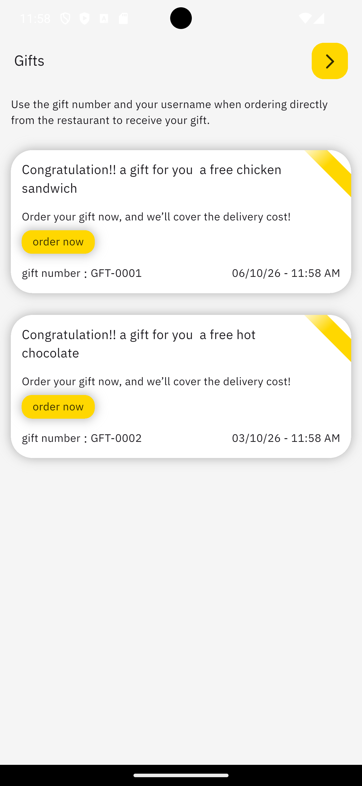
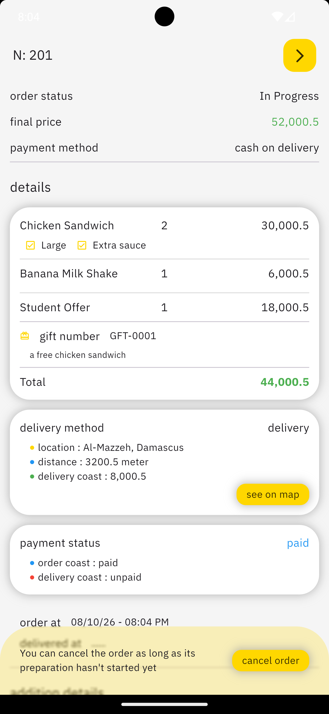
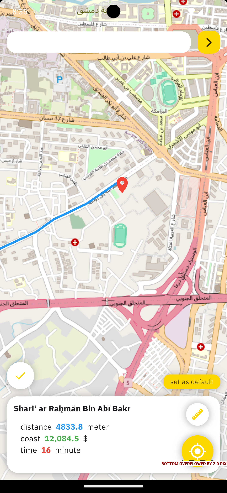
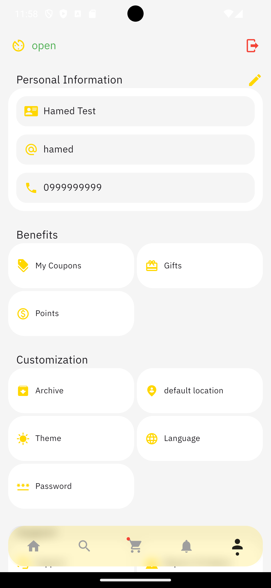

# 🍴 Fork Mate

A Flutter mobile app for ordering food from a restaurant. Customers can browse the menu, customize items, apply coupons and discount codes, pay with points, choose a delivery location on a map, and track their orders, all in **Arabic, English, or Spanish**, with **light and dark themes**.

> This repository contains the **frontend (customer app)** only. It currently talks to a mock REST API.

---

## 📑 Table of Contents

- [Features](#-features)
- [Tech Stack](#-tech-stack)
- [Project Structure](#-project-structure)
- [Localization](#-localization)
- [Screenshots](#-screenshots)
- [Roadmap](#-roadmap)

---

## ✨ Features

### 🔐 Authentication

- Multi-step sign-up (name → username → password → phone number → verification code)
- Login with username or phone number
- "Forgot password" flow using an SMS verification code, with a resend timer
- Auto-login using a saved token (route middleware)

### 🏠 Home

- Auto-scrolling advertisement carousel (network + local images)
- Live **store status** (open / closed)
- Sections for **Offers**, **Discounts**, **Top Items**, and **New Items**
- Live **countdown timers** for offers and discounts, items are removed automatically when they expire
- Horizontal and vertical lazy loading, pull-to-refresh, shimmer placeholders, and retry on network errors

### 🍔 Menu & Search

- Browse by **service → category → items**
- Instant local search plus server-side search
- Item details: ingredients, rating (1–5 stars), and customizable **preferences** (single-select / multi-select with price differences)

### 🛒 Cart & Orders

- Multiple pending orders in the cart, with edit, merge-duplicates, and delete
- Order a single item directly or add it to a cart order
- Order tabs: **Pending / In Progress / Canceled**
- Order details with items, offers, gifts, delivery, and payment info
- Cancel an order while it is still cancellable
- Red-dot notification badges for running and canceled orders

### 💳 Payment & Delivery

- Payment methods: **Cash on delivery, Points**
- Delivery methods: **Current location, Default location, Select on map, Restaurant pickup**
- Final price calculation that includes discount coupons, discount codes, free-delivery coupons, and delivery cost

### 🗺️ Location

- Interactive map (OpenStreetMap / Carto tiles)
- Search places by name, pick a point by tapping, or use GPS
- Route, distance, estimated time, and delivery price calculation
- Save a **default location**
- Location permission and service handling

### 🎁 Benefits

- **Coupons** (discount and free delivery) with expiry timers
- **Gifts** that can be added to an order
- **Points** balance and value

### ⚙️ Settings

- Edit personal information and change phone number (with verification)
- Change password (old password or verification code)
- Theme switcher (light / dark)
- Language switcher (Arabic / English / Spanish)
- Order archive grouped by year and month
- Logout and delete account

---

## 🧰 Tech Stack

| Area                            | Technology                                                                                                              |
| ------------------------------- | ----------------------------------------------------------------------------------------------------------------------- |
| Framework                       | [Flutter](https://flutter.dev) (Dart, Material 3)                                                                       |
| State management / DI / Routing | [GetX](https://pub.dev/packages/get)                                                                                    |
| Local storage                   | [Hive](https://pub.dev/packages/hive) (`hive_flutter`)                                                                  |
| Networking                      | [http](https://pub.dev/packages/http)                                                                                   |
| Maps                            | [flutter_map](https://pub.dev/packages/flutter_map) + [latlong2](https://pub.dev/packages/latlong2)                     |
| Routing & geocoding             | [OpenRouteService](https://openrouteservice.org/) and [Nominatim](https://nominatim.org/)                               |
| Location                        | [geolocator](https://pub.dev/packages/geolocator), [app_settings](https://pub.dev/packages/app_settings)                |
| UI helpers                      | `cached_network_image`, `shimmer`, `lottie`, `material_design_icons_flutter`, `font_awesome_flutter`, `cupertino_icons` |
| Localization                    | `flutter_localizations`, `intl`                                                                                         |

---

## 📂 Project Structure

```
lib/
├── app/                    # Global constants, colors, settings menu, AppServices (Hive storage)
├── binding/                # GetX bindings
├── controller/             # GetX controllers (business logic & state)
├── functions/              # Helper functions (dialogs, snackbars, formatting, logout, search...)
├── middleware/             # Route middleware (authentication check)
├── models/customer/        # Data models (items, offers, coupons, orders, locations...)
├── services/               # API calls (auth, customer data, home, orders, location...)
├── translations/           # ar_AE, en_US, es_ES translation maps
├── utils/                  # SizeConfig, location permission checker, helpers
├── view/
│   ├── authentication/     # Hello, login, sign-up pages
│   ├── customer/
│   │   ├── pages/          # Home, services, cart, settings, order details...
│   │   └── widget/         # Reusable customer widgets
│   ├── floating_bottom_bar/# Bottom navigation
│   ├── sections/           # Page sections (ads, offers, discounts, sign-up steps...)
│   ├── shared_widget/      # Buttons, indicators, section headers
│   └── shimmers/           # Loading placeholders
└── main.dart               # App entry point & route table
```

The app follows a **View → Controller → Service → Model** structure using GetX.

---

### Assets

The following assets are already declared in `pubspec.yaml`:

```yaml
flutter:
  assets:
    - assets/image/
    - assets/animation/fork_yellow.json
    - assets/animation/fork_orange.json
  fonts:
    - family: IBM # IBM Plex Sans Arabic (main app font)
    - family: NotoNaskhArabic
    - family: Tajawal
    - family: ScheherazadeNew
```

---

## 🌍 Localization

Translations are stored in `lib/translations/` using GetX's `Translations` class.

| Language         | Code | Direction |
| ---------------- | ---- | --------- |
| Arabic (default) | `ar` | RTL       |
| English          | `en` | LTR       |
| Spanish          | `es` | LTR       |

## 📸 Screenshots

| Home                          | search                            | Item Details                         | Cart                          | Cart Details                             |
| ----------------------------- | --------------------------------- | ------------------------------------ | ----------------------------- | ---------------------------------------- |
|  |  |  |  |  |

| Coupons                              | Gifts                           | Order Details                          | Location Picker             | Settings                             |
| ------------------------------------ | ------------------------------- | -------------------------------------- | --------------------------- | ------------------------------------ |
|  |  |  |  |  |

---

## 🗺️ Roadmap

- [ ] Connect to the real production backend
- [ ] Online payment integration
- [ ] Push notifications (Firebase Cloud Messaging)
- [ ] Notifications page with real data
- [ ] Persist the cart locally between sessions
- [ ] Support and "Report a problem" pages

---
